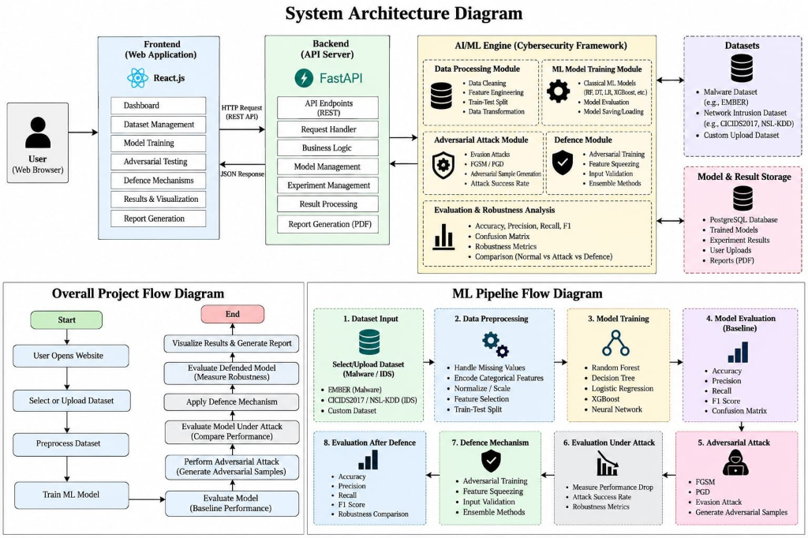

# AI Robustness & Defence Lab

A hands-on machine learning security lab built to evaluate how well malware and network intrusion detection models hold up against adversarial attacks, and how to defend them.

---

## 🌐 Live Deployments & Documentation

* 🚀 **Web Application (React 19):** [https://ai-robustness-defence-lab.vercel.app](https://ai-robustness-defence-lab.vercel.app)
* 📄 **Interactive API Documentation (Swagger UI):** [https://ai-robustness-defence-lab.vercel.app/docs](https://ai-robustness-defence-lab.vercel.app/docs)
* 📦 **GitHub Repository:** [https://github.com/LALI20006/ai-robustness-defence-lab](https://github.com/LALI20006/ai-robustness-defence-lab)

---

## Why this project?

Most machine learning models trained on network traffic or malware datasets look great in validation—often scoring 95%+ accuracy. But in real-world cybersecurity, attackers do not send clean data. By making tiny, bounded tweaks to network packets or PE file header features without breaking functionality, attackers can cause standard classifiers to completely misclassify threats as benign traffic.

We built this lab as an interactive workbench to:
1. Train standard cybersecurity classifiers on realistic tabular data.
2. Stress-test those models with controlled feature-space perturbations (simulated evasion attacks).
3. Measure the exact vulnerability (Attack Success Rate, Accuracy Degradation, and Prediction Flip Rate).
4. Apply defensive techniques (adversarial retraining, input bounds validation, voting ensembles) and see if they actually fix the problem.
5. Export clean, reproducible PDF reports with all comparison charts and confusion matrices.

---

## Architecture & Pipeline Flow



The project decouples into three main components:
* **React 19 Frontend:** Clean user interface with interactive tabs for dataset exploration, model training, perturbation simulation, and defense evaluation.
* **FastAPI Backend:** REST API managing data preprocessing, model lifecycle, and PDF report compilation.
* **AI/ML Security Framework:** 8-stage pipeline covering zero-leakage preprocessing, model training, bounded adversarial perturbations, and defensive hardening (adversarial training, input validation guards, and voting ensembles).

---

## What can you do in the lab?

* **Dataset Management:** Comes with pre-loaded benchmarks (NSL-KDD network intrusion traffic and static PE malware features), plus support for uploading your own `.csv`, `.tsv`, or `.parquet` datasets (up to 50MB).
* **Data Preprocessing:** Automated data cleaning, missing value handling, one-hot encoding, and scaling (Standard, MinMax, Robust) with zero-leakage stratified splits.
* **Model Training:** Train and benchmark multiple algorithms side-by-side:
  * Random Forest
  * Decision Tree
  * Logistic Regression
  * Support Vector Machine (SVM)
  * Gradient Boosting
  * Multi-Layer Perceptron (MLP Neural Network)
* **Adversarial Perturbation Lab:**
  * Bounded epsilon ($\epsilon$) feature attacks (targeting high-variance decision directions within valid domain bounds).
  * Gaussian and uniform random noise.
  * Feature masking and dropout sensitivity analysis.
  * Automatic computation of Attack Success Rate (ASR) and confidence drops.
* **Defensive Hardening:**
  * **Adversarial Training:** Retrain models with perturbed sample augmentation.
  * **Input Validation Guards:** Statistical anomaly detection, z-score outlier flags, and strict physical feature boundary checks.
  * **Ensemble Defense:** Hard and soft voting classifiers combining multiple diverse estimators.
* **Comparison & PDF Reports:** Side-by-side baseline vs. attacked vs. defended metrics, confusion matrix comparisons, and downloadable PDF research reports generated with ReportLab.

---

## Tech Stack

* **Frontend:** React 19, Vite, Tailwind CSS, Lucide Icons, Recharts
* **Backend:** FastAPI, Python 3.11+, Pydantic, SQLAlchemy
* **Machine Learning:** Scikit-Learn, NumPy, Pandas, Joblib
* **PDF Engine:** ReportLab
* **Database:** SQLite (default for local development) / PostgreSQL (production)

---

## Project Structure

```
ai-robustness-defence-lab/
├── backend/
│   ├── app/
│   │   ├── main.py              # FastAPI server & route orchestration
│   │   ├── config.py            # Environment configuration
│   │   ├── database.py          # SQLAlchemy engine & session setup
│   │   ├── ml/
│   │   │   ├── preprocessing/   # Data cleaning, scaling & encoders
│   │   │   ├── training/        # Model factory & training logic
│   │   │   ├── robustness/      # Adversarial perturbation generators & evaluators
│   │   │   ├── defenses/        # Adversarial retraining, guards & ensembles
│   │   │   └── evaluation/      # Accuracy, F1, ROC-AUC, confusion matrices
│   │   ├── routes/              # REST API endpoints
│   │   └── services/            # PDF report generator & demo workflows
│   └── requirements.txt         # Python dependencies
├── frontend/
│   ├── src/
│   │   ├── pages/               # React dashboard, lab & analysis pages
│   │   ├── components/          # Reusable UI & architecture blueprints
│   │   └── api/                 # Axios backend communication layer
│   ├── package.json
│   └── vite.config.js
├── data/
│   └── sample/                  # Bundled NSL-KDD and PE malware datasets
└── README.md
```

---

## Getting Started Locally

### Prerequisites
* Python 3.11 or newer
* Node.js 18+ and npm

### 1. Backend Setup
```bash
# Activate your virtual environment
python -m venv venv
.\venv\Scripts\activate       # Windows
# source venv/bin/activate    # Linux / macOS

# Install backend packages
pip install -r backend/requirements.txt

# Start the FastAPI server
uvicorn backend.app.main:app --reload --port 8000
```
Backend will be live at `http://127.0.0.1:8000`. You can test the interactive API docs at `http://127.0.0.1:8000/docs`.

### 2. Frontend Setup
In a new terminal window:
```bash
cd frontend
npm install
npm run dev
```
Open your browser at `http://localhost:5173`.

---

## Running the Quick Demo

If you want to see the whole pipeline in action right away:
1. Open the web interface.
2. Sign in or create a quick account.
3. Click the **"Run Demo Experiment"** button in the top navigation bar.
4. The system will automatically:
   * Load the NSL-KDD intrusion dataset.
   * Preprocess and split the data (80/20).
   * Train a Random Forest classifier (~95% baseline accuracy).
   * Run a 5% bounded perturbation attack (accuracy drops to ~78%).
   * Augment the training data with adversarial samples and retrain.
   * Defend the model (recovers back to ~88% robust accuracy).
   * Display all the comparison charts and generate a downloadable PDF report.

---

## Deployment

* **Frontend:** Deployed on [Vercel](https://vercel.com) using the `frontend` root directory and Vite preset.
* **Backend:** Deployed on [Render](https://render.com) using the included `render.yaml` configuration.

---

## Ethical Use & Research Scope

This laboratory is created strictly for academic research, education, and offline defensive model benchmarking. It evaluates tabular feature vectors offline and does not contain live malware payloads, network packet sniffers, or exploit tools.
